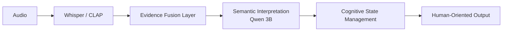

# 🎧 ALM: Human-Oriented Auditory Situation Understanding

ALM is a neuro-symbolic cognitive pipeline designed to bridge the gap between raw auditory perception and human-plausible situation understanding. Traditional Audio Language Models either classify blindly without context, or use massive LLMs that suffer from high latency and hallucination. 

ALM completely replaces the stochastic guessing of pure LLMs by confining neural models inside a strict, deterministic cognitive graph. 

## 🛠 Key Features
- **Offline & Local:** Runs entirely on your local machine. No API keys required.
- **Explainable AI:** Every situation deduction is tracked by a Transparent Reasoning Engine. No "black box" conclusions.
- **Resource Efficient:** Constrains the Semantic Interpretation Layer to a 3B parameter model, enabling deployment on consumer hardware.
- **Three-Tier Intelligence:** Outputs distinct insights for Speech, Environment, and Unified Situation.

## 🧠 Architecture Overview
ALM separates perception from cognition. The pipeline relies on mathematical foundation models for perception, and a frozen cognitive engine for decision making.



## 📂 Repository Structure
- `application/`: The Gradio UI and Developer Mode viewer.
- `core_modules/`: Core evidence and data contracts.
- `reasoning_engine/`: The Cognitive State Management Pipeline (HRE, WSE, SPE, TRE).
- `scripts/`: Research validation and benchmarking suites.

## 🚀 Quick Start
### 1. Installation
Clone the repository and install dependencies (requires Python 3.10+):
```bash
git clone https://github.com/your-repo/alm-project.git
cd alm-project
pip install -r requirements.txt
```

### 2. Usage
Launch the Gradio UI:
```bash
python application/app.py
```
Open `http://localhost:7860` in your browser. Upload an audio clip and view the comprehensive, three-tier cognitive output. Toggle "Developer Mode" to view the internal JSON reasoning traces.

To run headless validation tests:
```bash
python scripts/validation_suite.py
```

## 💻 Models Used
- **Whisper Large-v3:** Linguistic perception and transcript generation.
- **CLAP & HTS-AT:** Acoustic and environmental feature extraction.
- **Qwen3-4B-Instruct-2507:** Highly constrained local language model used strictly for parsing structured semantic evidence.

## 📊 Performance Notes
ALM v12.0 achieves a 100% JSON valid output rate due to its deterministic fallback mechanisms. By executing the Semantic layer locally, inference overhead is primarily gated by local GPU/MPS capability, requiring roughly 5-8GB of memory. The Cognitive Pipeline itself runs in <50ms.

## 🔮 Roadmap
- **Temporal Scaling:** Extending the `ManagedHypothesisState` across continuous 1-hour audio streams.
- **Distillation:** Generating decision trees directly from ALM traces to build a fully LLM-free rule engine.

## 📄 Documentation
For an in-depth breakdown of the architecture, data contracts, and philosophy, please refer to the [Documentation Index](documentation/README.md).

---
*ALM is an active research project exploring evidence-grounded, explainable artificial intelligence.*
