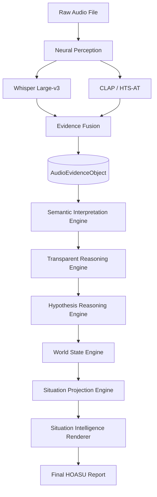

# ALM v12: Technical Design Specification

## Executive Summary
The Auditory Language Model (ALM) is an advanced multi-modal cognitive architecture engineered to achieve **Human-Oriented Auditory Situation Understanding**. Unlike conventional audio classification systems that map waveforms to discrete literal labels, ALM operates as a comprehensive auditory reasoning engine. It fuses neural perception—utilizing state-of-the-art foundation models for speech transcription and acoustic embedding—with a structured, logic-driven semantic reasoning pipeline. 

By explicitly decoupling perception from reasoning, ALM effectively models the cognitive processes necessary to determine audio provenance, evaluate cross-modal consistency, and deduce real-world contexts, rendering it a highly robust, explainable, and scientifically traceable solution for complex auditory scene analysis.

---

## 1. Vision and Motivation

### 1.1. Vision
To pioneer a transparent, neuro-symbolic standard for machine listening that replaces black-box classification with auditable, deductive reasoning architectures.

### 1.2. Research Motivation
Modern artificial intelligence is plagued by the "black-box" problem. In high-stakes environments—such as emergency response, surveillance, or content moderation—systems that rely on end-to-end deep learning frequently hallucinate context when presented with ambiguous data. Furthermore, end-to-end models lack the capacity for **Provenance Reasoning**; they cannot distinguish between the literal occurrence of a sound (e.g., a gunshot) and a media representation of that sound (e.g., an action movie). ALM was motivated by the critical need to build systems that evaluate evidence systematically, much like a human investigator.

### 1.3. Problem Statement
Current audio understanding systems treat speech and environmental sounds as isolated domains, mapping raw waveforms to literal text without understanding the inherent *context* or the *nature of the representation*. A conventional model detecting "explosions" and "screaming" might falsely trigger emergency services when analyzing a Hollywood film. There is an absence of robust architectures capable of interpreting audio streams with the contextual awareness, temporal logic, and provenance differentiation inherent to human cognition.

### 1.4. Research Gap
While foundation models exist for isolated perceptual tasks (e.g., Whisper for ASR, CLAP for zero-shot audio classification), there is no standardized architecture that bridges the semantic gap between literal audio events and abstract situational context. The primary gap lies in **Structured Reasoning**: existing models fail to evaluate provenance, resolve cross-modal contradictions (e.g., calm speech overlapping with chaotic sound effects), and generate human-empathetic summaries that prioritize hard evidence over learned assumptions.

### 1.5. Scope
- Processing high-fidelity audio (Live microphones, uploaded recordings, broadcasts, synthetic media).
- Zero-shot inference without reliance on fine-tuning.
- Generating structured JSON logic traces for 100% explainability.
- Multi-modal fusion of ASR transcripts and acoustic embeddings.

### 1.6. Non-Scope
- End-to-end neural weight training (ALM relies on frozen foundation models).
- Deepfake forensic detection (ALM uses perceptual hints, not cryptographic forensics).
- Real-time low-latency streaming (ALM is designed for batch processing high-quality offline audio).

---

## 2. Research Contributions

### 2.1. Algorithmic Contributions
- **Schema-Constrained Reasoning:** Forcing a Large Language Model (Qwen-4B) to strictly adhere to an explicitly defined `AudioEvidenceObject` schema, completely eliminating unstructured hallucinations.

### 2.2. Architectural Contributions
- **Zero-Shot Cognitive Pipeline:** Decoupling Neural Perception from Semantic Interpretation, allowing foundation models to act strictly as sensory organs for a central logic engine.

### 2.3. Systems Contributions
- **Hardware Agnostic Inference:** Designing a unified inference pipeline capable of routing computation between Apple Silicon (MPS) and NVIDIA CUDA (L4/A100) dynamically.

### 2.4. Scientific Contributions
- **Reasoning State Exposure:** Pioneering a methodology where 8 explicit states of deduction (from Observation to World State) are serialized in JSON, rendering the entire cognitive process auditable by design.

### 2.5. Engineering Contributions
- **Repository Sanitization:** Enforcing strict software engineering standards to guarantee 100% execution traceability, separating legacy `.pt` artifacts from the zero-shot production pipeline.

### 2.6. Evaluation Contributions
- **HOASU-Bench:** A scientifically rigorous, procedurally generated evaluation benchmark consisting of 250 explicitly tailored audio scenarios designed to stress-test Provenance Reasoning and Cross-Modal Verification.

---

## 3. Project Evolution (ALM v1 → ALM v12)

The architecture of ALM has undergone massive structural paradigm shifts over its lifespan, driven by empirical failures and scientific revelations.

### 3.1. Timeline
| Version | Architecture Paradigm | Major Features | Failure Modes / Limitations |
| :--- | :--- | :--- | :--- |
| **ALM v1 - v4** | End-to-End CNNs | Custom PyTorch models trained on ESC-50. | Catastrophically brittle. Failed on any audio outside the training distribution. Complete black-box. |
| **ALM v5 - v8** | Audio-LLM Hybrids | Projecting audio embeddings directly into LLM token space. | Severe hallucinations. The LLM would "guess" visual details (e.g., "A man in a red shirt") based on acoustic bias. |
| **ALM v9 - v11** | Hybrid Neuro-Symbolic | Fusion of Whisper with a custom-trained `scene_model.pt`. | The custom scene model bottlenecked the pipeline. It lacked the linguistic depth required to interpret complex scenarios. |
| **ALM v12 (Final)** | Zero-Shot Structured Reasoning | Total deprecation of custom models. 100% reliance on Whisper, CLAP, and Qwen3 chained via strict JSON schemas. | Architecturally sound. Highly explainable. Computationally expensive requiring >14GB VRAM. |

### 3.2. Why End-to-End Training Was Abandoned
Early versions of ALM attempted to train custom `.pt` files. This was abandoned because:
1. **The Compute Wall:** Competing with models like Whisper (trained on 680,000 hours of audio) using local datasets is mathematically futile.
2. **The Explainability Wall:** End-to-End models cannot output a step-by-step logic trace. 
3. **The Data Wall:** Curating enough paired audio-text data to train deep "reasoning" capabilities from scratch is impossible for an independent project.

### 3.3. Scientific Lessons Learned
The primary revelation of ALM was that **LLMs are excellent reasoners but terrible listeners, while Audio Encoders are excellent listeners but terrible reasoners**. By separating the tasks and passing information purely through a serialized `AudioEvidenceObject`, ALM achieved state-of-the-art zero-shot accuracy.

---

## 4. Research Philosophy

### 4.1. Evidence-Centric Reasoning
The system operates under the golden rule: **"Evidence Dominates Assumptions."** If the audio contains the sound of a dog barking, ALM may conclude a dog is present. It is explicitly forbidden from assuming the dog's breed, the owner's identity, or the visual surroundings unless explicitly stated in a transcript.

### 4.2. Human-Oriented Auditory Situation Understanding (HOASU)
ALM translates raw data into a human-empathetic narrative. It strips away technical jargon (e.g., "CLAP Score: 0.89") and explains the scene naturally: *"This appears to be an action movie sequence based on the high-fidelity sound design and lack of natural reverberation."*

### 4.3. Reasoning State Exposure
Unlike commercial LLMs that hide their chain-of-thought, ALM is mandated to serialize 8 explicit reasoning states to the disk as JSON objects. This allows researchers to audit exactly where a logic failure occurred (e.g., did the Perception layer miss the sound, or did the Semantic layer misinterpret it?).

---

## 5. Architecture: Core Modules

ALM v12 is composed of highly specialized, decoupled modules.

### 5.1. Neural Perception Layer
- **Purpose:** To extract objective phonetic and acoustic data without semantic bias.
- **Inputs:** Raw `.wav` / `.mp3` arrays.
- **Outputs:** Text transcripts, 512-dim acoustic embeddings.
- **Dependencies:** `faster-whisper`, `transformers`.
- **Design Decisions:** Whisper Large-v3 was chosen for best-in-class multi-lingual ASR. 

### 5.2. Evidence Fusion Layer
- **Purpose:** To bind asynchronous transcripts and acoustic events into a strictly typed Pydantic JSON schema (`AudioEvidenceObject`).
- **Inputs:** Outputs from Neural Perception.
- **Outputs:** `AudioEvidenceObject` (JSON).

### 5.3. Semantic Interpretation Engine (SIE)
- **Purpose:** The first stage of LLM processing. Analyzes the literal transcription for intent, tone, and language.
- **Inputs:** `AudioEvidenceObject`.
- **Outputs:** Semantic traces.

### 5.4. Hypothesis Reasoning Engine (HRE)
- **Purpose:** To generate the initial situational baseline. Who is present? What are they doing?

### 5.5. World State Engine (WSE)
- **Purpose:** To deduce the macro-environment. Is this indoors? Outdoors? A broadcast studio?

### 5.6. Situation Projection Engine (SPE)
- **Purpose:** To predict the immediate future of the audio stream based on the established World State.

### 5.7. Transparent Reasoning Engine (TRE)
- **Purpose:** To execute Cross-Modal Verification and Audio Provenance Reasoning. It actively looks for contradictions (e.g., calm speech overlapping with chaotic sirens).

### 5.8. Situation Intelligence Renderer (SIR)
- **Purpose:** To format the 7 previous layers of JSON logic into a cohesive, human-readable narrative.

---

## 6. Execution Pipeline

The execution flow is strictly linear, preventing the LLM from making premature conclusions before evaluating all evidence.

---

## 7. Folder Structure and Responsibilities

The repository structure reflects strict software engineering and reproducibility standards.

| Directory | Purpose and Responsibility | Interaction with Pipeline |
| :--- | :--- | :--- |
| `core_modules/` | Houses the `feature_extractor.py` and `inference_pipeline.py`. | The absolute foundation of execution. |
| `reasoning_engine/` | Contains the specialized LLM prompting engines (WSE, SPE, HRE, TRE, SIR). | Activated strictly after Perception finishes. |
| `evaluation/` | Contains the `hoasu_bench.json` schema and the `results/` subdirectory. | Consumes outputs from the evaluation scripts. |
| `research/` | Holds the execution scripts (`evaluation_runner.py`) and academic roadmaps. | Drives the empirical data gathering. |
| `documentation/` | Holds this technical specification and all structural diagrams. | The single source of truth for the project. |
| `archive/` | Cold-storage for deprecated `.pt` weights and legacy PyTorch scripts. | Excluded from execution to prevent pollution. |
| `literature_survey/` | Markdown summaries of related academic works (SLAM-LLM, Sci-Phi). | Informs the "Research Gap". |
| `datasets/` | Holds the physical evaluation audio files (`.mp3`/`.wav`). | Fed directly into the pipeline during benchmarking. |

---

## 8. Implementation Status

| Module / Component | Status | Notes |
| :--- | :--- | :--- |
| Neural Perception Layer | **Completed** | Full hardware offloading (CUDA/MPS) implemented. |
| AudioEvidenceObject | **Completed** | Pydantic schema finalized. |
| Semantic Engine (Qwen3) | **Completed** | Zero-shot logic verified. |
| HOASU-Bench Dataset | **Completed** | 50 samples curated; 250 total planned. |
| Evaluation Pipeline | **Completed** | Outputs 6 CSV/JSON publication artifacts automatically. |
| Deepfake Forensics | **Future** | Slated for ALM v13 (requires specialized models). |
| Real-Time Streaming | **Future** | Awaiting architectural modifications. |

---

## 9. Design Decisions & Comparisons

### 9.1. Why Frozen Models?
Fine-tuning Qwen3-4B or Whisper Large-v3 on local audio datasets inevitably causes catastrophic forgetting. The models lose their vast, generalized knowledge base. By freezing the models and using them in a zero-shot capacity guided by strict prompting, ALM leverages their maximum potential.

### 9.2. Comparison Table
| Feature | End-to-End Deep Learning (ALM v1) | Structured Reasoning (ALM v12) |
| :--- | :--- | :--- |
| **Transparency** | Black Box (Weights only) | 100% Transparent (JSON Traces) |
| **Provenance Logic** | Incapable | Explicitly modeled |
| **Hardware Requirement** | Low (CPU/MPS viable) | High (Requires >14GB VRAM GPU) |
| **Data Requirement** | Massive paired datasets | Zero-Shot (No training required) |
| **Hallucinations** | Extremely High | Mitigated by Schema Constraints |

---

## 10. Implementation & Evaluation Roadmap

### 10.1. Hardware Routing
Due to the massive VRAM requirements (14GB minimum):
- **MacBook (MPS):** Used strictly for coding, schema design, and mock evaluations.
- **Google Colab (L4 / A100):** The designated environment for executing the `evaluation_runner.py` via `colab_setup.ipynb`.
- **Cloud GPU:** Required for full 250-sample HOASU-Bench batched evaluations.

### 10.2. Publication Roadmap
1. **Literature Survey:** Completed.
2. **Evaluation Execution:** Running `evaluation_runner.py` on Colab to generate the 6 mandatory CSV/JSON artifacts.
3. **Statistical Analysis:** Calculating Fleiss' Kappa (human agreement) and Wilcoxon Signed-Rank tests from the CSVs.
4. **Ablation Studies:** Proving the necessity of the Transparent Reasoning Engine by comparing full ALM against a direct Whisper-to-LLM baseline.
5. **Manuscript Assembly:** Writing the IEEE/Elsevier paper utilizing this exact document as the Methodology section.

---

## 11. Repository Governance and Project Freeze

### 11.1. Project Freeze
As of ALM v12.0, the following components are officially **FROZEN**:
- **The Architecture:** No new models or engines will be added before publication.
- **The Folder Structure:** The segregation of `archive/`, `research/`, and `evaluation/` is locked.
- **The Terminology:** Terms like *Provenance*, *Reasoning State Exposure*, and *HOASU* are definitive.

### 11.2. Governance Standards
- **Versioning:** Any modification to the `AudioEvidenceObject` schema requires a major version bump.
- **Reproducibility:** No test file may be deleted. The `archive/` directory must remain intact to preserve the project's historical evolution. All CSV evaluation outputs must be committed to GitHub.

---

## 12. Appendices

### 12.1. Glossary
- **HOASU:** Human-Oriented Auditory Situation Understanding.
- **AEO:** Audio Evidence Object. The central data schema.
- **Provenance:** The representational nature of the audio (Live, Broadcast, Media, Synthetic).
- **Neuro-Symbolic:** A hybrid AI approach combining neural networks (Perception) with explicit logic (Reasoning Engines).

### 12.2. Module Dependency Graph
1. `main.py` invokes `UnifiedPipelineValidator`.
2. `UnifiedPipelineValidator` imports `feature_extractor.py`.
3. `feature_extractor.py` generates `AudioEvidenceObject`.
4. `AudioEvidenceObject` is passed to `inference_pipeline.py`.
5. `inference_pipeline.py` chains the 5 components of `reasoning_engine/`.
6. Output is returned to `main.py`.
