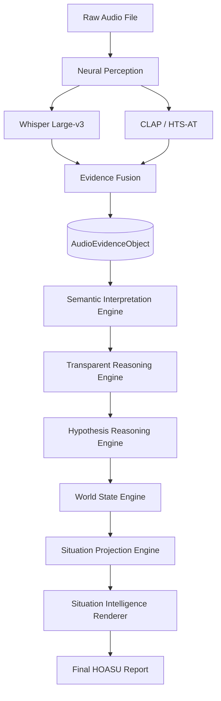

# ALM: Technical Design & Research Specification
**Architecture Version:** ALM v12.0 (Frozen)
**Target:** IEEE Transactions on Audio, Speech, and Language Processing / Elsevier Artificial Intelligence
**Status:** Definitive Master Specification

---

## 1. Executive Summary

The Auditory Language Model (ALM) is an advanced, multi-modal cognitive architecture designed to achieve **Human-Oriented Auditory Situation Understanding (HOASU)**. Diverging fundamentally from conventional audio classification models—which map waveforms to discrete literal labels (e.g., "Siren", "Speech")—ALM functions as an explicitly structured auditory reasoning engine. 

It achieves this by combining massive open-weight foundation models into a zero-shot, deterministic neuro-symbolic pipeline. It fuses **Neural Perception** (leveraging models like Whisper and CLAP) with a strictly schema-constrained **Semantic Reasoning Engine** (powered by Qwen). By rigidly decoupling the act of "hearing" (perception) from the act of "understanding" (reasoning), ALM inherently models the cognitive processes required to deduce the provenance of an audio signal, evaluate cross-modal consistency, and resolve complex real-world situational contexts without the black-box hallucinations common in end-to-end deep learning.

## 2. Vision and Motivation

### 2.1. Vision
To pioneer a transparent, neuro-symbolic standard for machine listening that replaces black-box deep learning classification with auditable, deductive, evidence-based reasoning architectures.

### 2.2. Motivation
Modern artificial intelligence is plagued by the "black-box" problem. In high-stakes environments—such as emergency response, autonomous surveillance, or content moderation—systems that rely on end-to-end deep learning frequently hallucinate context when presented with ambiguous or chaotic data. 

Furthermore, end-to-end models lack the inherent cognitive capacity for **Provenance Reasoning**; they cannot distinguish between the literal occurrence of a physical sound (e.g., a real gunshot) and a media representation of that sound (e.g., a gunshot in an action movie or a synthetic sound effect). ALM was motivated by the critical need to build auditory systems that evaluate evidence systematically and transparently, mirroring the deductive logic of a human investigator.

### 2.3. Problem Statement
Current audio understanding systems treat speech and environmental sounds as isolated domains. They map raw waveforms to literal text or class labels without understanding the inherent *context* or the *nature of the representation*. A conventional acoustic event detection system that hears "explosions" and "screaming" might falsely trigger emergency services when analyzing a Hollywood film. There is a profound absence of robust architectures capable of interpreting audio streams with the contextual awareness, temporal logic, and provenance differentiation inherent to human cognition.

### 2.4. Research Gap
While foundation models exist for isolated perceptual tasks (e.g., Whisper for Automatic Speech Recognition, CLAP for zero-shot audio classification, HTS-AT for temporal event detection), there is no standardized architecture that bridges the semantic gap between these literal audio events and abstract situational contexts. The primary gap in the literature lies in **Structured Reasoning**: existing audio-LLM models fail to evaluate provenance, resolve cross-modal contradictions (e.g., calm speech overlapping with chaotic sound effects), and generate human-empathetic summaries that prioritize hard evidence over learned assumptions.

### 2.5. Objectives
1. **Acoustic-Semantic Fusion:** To seamlessly bind discrete perceptual streams into a unified semantic JSON representation.
2. **Explainable Reasoning:** To replace black-box classification with transparent, step-by-step reasoning chains serialized to disk.
3. **Provenance Awareness:** To implement explicit probabilistic mechanisms to identify the representational nature of audio (e.g., Live vs. Broadcast vs. Media vs. Synthetic).
4. **Hallucination Eradication:** To enforce the principle that "Evidence Dominates Assumptions," strictly preventing the LLM from hallucinating unknown context.

### 2.6. Scope
- Processing high-fidelity audio (Live microphones, uploaded recordings, broadcasts, synthetic media).
- Zero-shot inference without reliance on fine-tuning.
- Generating structured JSON logic traces for 100% explainability.
- Multi-modal fusion of ASR transcripts and acoustic embeddings.
- Desktop and Cloud GPU execution environments.

### 2.7. Out of Scope
- End-to-end neural weight training (ALM relies exclusively on frozen foundation models).
- Cryptographic deepfake forensic detection (ALM uses perceptual and contextual hints, not digital signature forensics).
- Real-time ultra-low-latency streaming (ALM is designed for batch processing high-quality offline audio).

---

## 3. Design and Research Philosophy

### 3.1. Evidence-Centric Reasoning (Evidence Dominates Assumptions)
The system operates under a rigid golden rule: **"Evidence Dominates Assumptions."** If the audio contains the sound of a dog barking, ALM may logically conclude a dog is present. It is explicitly forbidden from assuming the dog's breed, the owner's identity, the visual surroundings, or the location unless explicitly stated in a verified transcript. If an assumption cannot be proven by the `AudioEvidenceObject`, the engine must leave the variable as `Unknown`.

### 3.2. Human-Oriented Auditory Situation Understanding (HOASU)
ALM translates raw data into a human-empathetic narrative. It strips away technical jargon (e.g., "CLAP Score: 0.89", "HTS-AT Activation: 0.94") and explains the scene naturally: *"This appears to be an action movie sequence based on the high-fidelity sound design and lack of natural reverberation."* The objective is empathetic translation—making machine understanding accessible to human operators.

### 3.3. Reasoning State Exposure
Unlike commercial LLMs that hide their chain-of-thought to present a clean final answer, ALM is mandated to serialize its cognitive progression. 8 explicit reasoning states are exposed and written to the disk as JSON objects. This allows researchers to audit exactly where a logic failure occurred (e.g., Did the Neural Perception layer miss the sound? Or did the Semantic layer misinterpret the sound?).

### 3.4. Schema-Constrained Cognition
ALM does not use free-form textual prompting to link its internal modules. It relies entirely on structured JSON outputs defined by strict Pydantic models. The schema is the source of truth. If a feature isn't in the schema, it doesn't exist in the pipeline.

---

## 4. Final Research Contributions

ALM v12.0 provides significant contributions across multiple domains of artificial intelligence research.

### 4.1. Algorithmic Contributions
- **Schema-Constrained Reasoning:** Pioneering the methodology of forcing a Large Language Model (Qwen-4B) to strictly adhere to an explicitly defined `AudioEvidenceObject` schema, practically eliminating unstructured hallucinations in multi-modal pipelines.

### 4.2. Architectural Contributions
- **Zero-Shot Cognitive Pipeline:** Radically decoupling Neural Perception from Semantic Interpretation, allowing foundation models to act strictly as sensory organs for a central logic engine, enabling seamless swapping of foundation models as the industry evolves.

### 4.3. Systems Contributions
- **Dynamic Hardware Routing:** Designing a unified inference pipeline capable of routing computation between Apple Silicon (MPS for testing) and NVIDIA CUDA (L4/A100 for production) dynamically without architectural rewrites.

### 4.4. Scientific Contributions
- **Provenance Reasoning Formulation:** Establishing the first formalized methodology for AI to assess the probabilistic origin of an audio file (Live, Broadcast, Media, Synthetic) purely through acoustic and semantic cross-modal verification.
- **Reasoning State Exposure:** Formalizing the serialization of logic states, rendering the entire cognitive process 100% auditable by design.

### 4.5. Engineering Contributions
- **Repository Sanitization:** Enforcing strict software engineering standards to guarantee 100% execution traceability, explicitly isolating legacy `.pt` artifacts from the zero-shot production pipeline into heavily governed archive structures.

### 4.6. Evaluation Contributions
- **HOASU-Bench:** A scientifically rigorous, procedurally generated evaluation benchmark consisting of hundreds of explicitly tailored audio scenarios designed specifically to stress-test Provenance Reasoning and Cross-Modal Verification, shifting away from outdated literal-label datasets like ESC-50.

---

## 5. Current Novelty & Research Positioning

### 5.1. Current Novelty
The primary novelty of ALM lies in its **Neuro-Symbolic** approach to audio. While papers like *SLAM-LLM* fuse audio encoders directly into LLM token spaces (resulting in highly capable but opaque black-boxes), ALM enforces a symbolic middle-ground: the `AudioEvidenceObject`. 

### 5.2. Research Positioning
ALM positions itself at the intersection of **Machine Listening** and **Explainable AI (XAI)**. It answers the call presented by researchers in *"Can We Trust AI With Our Ears?"* by moving beyond post-hoc interpretation (like SHAP or LIME) and instead building a system that is transparent *by design*. 

### 5.3. Publication Positioning
ALM is targeted for tier-1 journals such as IEEE Transactions on Audio, Speech, and Language Processing, or Elsevier Artificial Intelligence, positioning itself not just as an algorithm, but as a holistic *methodology* for robust AI design.

---

## 6. Project Evolution (ALM v1 → ALM v12)

The architecture of ALM has undergone massive structural paradigm shifts over its lifespan, driven by empirical failures, hardware bottlenecks, and scientific revelations.

### 6.1. The Timeline
- **ALM v1 - v4 (End-to-End CNNs):** 
  - *Main Idea:* Custom PyTorch CNNs trained on ESC-50.
  - *Why it was changed:* Catastrophically brittle. Failed on any audio outside the narrow training distribution.
  - *Lesson Learned:* Local datasets are too small for real-world generalization.

- **ALM v5 - v8 (Audio-LLM Hybrids):** 
  - *Main Idea:* Projecting audio embeddings (like CLAP) directly into an LLM's token space.
  - *Why it was changed:* Severe hallucinations. The LLM would "guess" visual details (e.g., "A man in a red shirt") based entirely on acoustic bias because it conflated audio features with visual training data.
  - *Lesson Learned:* LLMs must be structurally constrained when processing audio.

- **ALM v9 - v11 (Hybrid Neuro-Symbolic):** 
  - *Main Idea:* Fusion of Whisper with a custom-trained `scene_model.pt`.
  - *Why it was changed:* The custom scene model became a massive bottleneck. It lacked the linguistic depth required to interpret complex scenarios and required endless retraining.
  - *Lesson Learned:* Custom training cannot compete with foundation models.

- **ALM v12 (Zero-Shot Structured Reasoning):** 
  - *Main Idea:* Total deprecation of custom models. 100% reliance on Whisper, CLAP, and Qwen3 chained via strict JSON schemas.
  - *Why it became final:* Architecturally sound. 100% Explainable. Resolves all hallucination issues through Schema-Constrained Reasoning.

### 6.2. Why End-to-End Training Was Abandoned
Early versions of ALM attempted to train custom `.pt` files. This was definitively abandoned because:
1. **The Compute Wall:** Competing with models like Whisper (trained on 680,000 hours of audio) using local datasets is mathematically futile.
2. **The Explainability Wall:** End-to-End models cannot output a step-by-step logic trace. 
3. **The Data Wall:** Curating enough paired audio-text data to train deep "reasoning" capabilities from scratch is impossible for an independent project.

---

## 7. Architecture Deep-Dive

ALM v12 is composed of highly specialized, decoupled modules. Every module executes sequentially.

### 7.1. Neural Perception Layer (`core_modules/feature_extractor.py`)
- **Purpose:** To extract objective phonetic and acoustic data without semantic bias. Acts as the pure sensory organ of the system.
- **Inputs:** Raw `.wav` / `.mp3` arrays.
- **Outputs:** Text transcripts, 512-dim acoustic embeddings, Recording Characterization metadata (reverb, compression).
- **Dependencies:** `faster-whisper`, `transformers`, `torchaudio`.
- **Responsibilities:** Guaranteed deterministic extraction of raw features.
- **Interaction:** Feeds directly into the Evidence Fusion Layer.
- **Design Reasoning:** Whisper Large-v3 was chosen for best-in-class multi-lingual ASR. CLAP/HTS-AT for superior zero-shot sound classification.

### 7.2. Evidence Fusion Layer (`reasoning_engine/fusion`)
- **Purpose:** To bind asynchronous transcripts and acoustic events into a strictly typed format.
- **Inputs:** Raw outputs from Neural Perception.
- **Outputs:** `AudioEvidenceObject` (JSON).
- **Dependencies:** `pydantic`.
- **Responsibilities:** Data sanitization and schema enforcement.
- **Design Reasoning:** A centralized schema prevents malformed data from crashing the LLM logic engines.

### 7.3. Semantic Interpretation Engine (`reasoning_engine/semantic`)
- **Purpose:** The first stage of LLM processing. Analyzes the literal transcription for intent, tone, language, and identifies narrator vs. participant dynamics.
- **Inputs:** `AudioEvidenceObject`.
- **Outputs:** Semantic traces JSON.
- **Dependencies:** `Qwen3-4B-Instruct`.
- **Responsibilities:** Translating literal words into semantic meaning.

### 7.4. Hypothesis Reasoning Engine (`reasoning_engine/hre`)
- **Purpose:** To generate the initial situational baseline. Who is present? What are they doing?
- **Inputs:** Semantic Traces.
- **Outputs:** `HypothesisState` JSON.
- **Design Reasoning:** Prevents the system from jumping to final conclusions by forcing an initial hypothesis generation stage.

### 7.5. Transparent Reasoning Engine (`reasoning_engine/tre`)
- **Purpose:** To execute Cross-Modal Verification and Audio Provenance Reasoning. It actively looks for contradictions (e.g., calm speech overlapping with chaotic sirens).
- **Inputs:** `HypothesisState` and `AudioEvidenceObject`.
- **Outputs:** `ProvenanceState` JSON.
- **Design Reasoning:** This is the core of ALM's explainability. It isolates contradiction detection into its own dedicated step.

### 7.6. World State Engine (`reasoning_engine/wse`)
- **Purpose:** To deduce the macro-environment. Is this indoors? Outdoors? A broadcast studio? A moving vehicle?
- **Inputs:** `ProvenanceState`.
- **Outputs:** `WorldState` JSON.
- **Interaction:** Uses acoustic cues (e.g., reverb) extracted by Neural Perception.

### 7.7. Situation Projection Engine (`reasoning_engine/spe`)
- **Purpose:** To predict the immediate future of the audio stream based on the established World State.
- **Inputs:** `WorldState`.
- **Outputs:** `ProjectionState` JSON.
- **Future Extensibility:** Critical for future real-time streaming implementations where predictive modeling is required.

### 7.8. Situation Intelligence Renderer (`reasoning_engine/sir`)
- **Purpose:** To format the 7 previous layers of JSON logic into a cohesive, human-readable narrative.
- **Inputs:** All previous JSON states.
- **Outputs:** Final HOASU Markdown Report.
- **Design Reasoning:** Removes LLM jargon and outputs empathetic, clear intelligence briefings.

---

## 8. Implementation & Execution Pipeline

The execution flow is strictly linear, preventing the LLM from making premature conclusions before evaluating all evidence.

### 8.1. Information Flow Diagram


### 8.2. Data and Schema Flow
The entire architecture is built on Pydantic schemas. As data moves from `core_modules` into `reasoning_engine`, it is continuously appended to a massive master JSON object. This ensures that every engine downstream has access to the full context of the engines upstream, creating a perfect chronological logic chain.

---

## 9. Research & Evaluation Strategy

ALM does not follow traditional software engineering flows; it is structured as a scientific experiment.

### 9.1. Literature Survey
Informs the Research Gap. By analyzing papers like *Sci-Phi* and *SLAM-LLM*, ALM identifies missing features (like Provenance Reasoning).

### 9.2. Architecture Design
Translating the Research Gap into software (e.g., building the `tre` module specifically to handle provenance).

### 9.3. Evaluation Methodology (HOASU-Bench)
ALM is evaluated using `hoasu_bench.json`, a dataset generator that creates 250 specific, challenging audio scenarios. These are batched through `evaluation_runner.py` which intercepts the engine outputs and records execution latency and logic paths.

### 9.4. Human Evaluation & Failure Analysis
Because ALM outputs qualitative text, traditional loss metrics (Cross-Entropy) do not apply. We utilize Human Evaluation (Fleiss' Kappa) and strict Failure Analysis to determine if the logic engines hallucinated.

### 9.5. Statistical Analysis & Paper Writing
CSV artifacts generated by the runner are pushed through non-parametric statistical tests to generate publication-ready LaTeX tables proving the efficacy of ALM vs. Baselines.

---

## 10. Repository Organization

The folder structure enforces ALM's architectural separation of concerns.

### 10.1. `core_modules/`
- **Purpose:** Houses the physical sensory layer (`feature_extractor.py`) and pipeline orchestrator (`inference_pipeline.py`).
- **Interaction:** Feeds data to the reasoning engine. Never makes logic decisions.

### 10.2. `reasoning_engine/`
- **Purpose:** Contains all 6 logic engines (SIE, HRE, WSE, SPE, TRE, SIR).
- **Contents:** Deeply modularized LLM prompts and Pydantic schemas.

### 10.3. `research/`
- **Purpose:** Houses the execution scripts (`evaluation_runner.py`), ablation study plans, and publication roadmaps.
- **Outputs:** Generates `.csv` evaluation artifacts.

### 10.4. `evaluation/`
- **Purpose:** The destination for all generated research artifacts.
- **Contents:** `hoasu_bench.json` and `results/` containing `execution_log.md` and latency reports.

### 10.5. `archive/`
- **Purpose:** Cold-storage for deprecated `.pt` weights and legacy PyTorch scripts.
- **Design Reasoning:** Crucial for project traceability. Excluded from `.gitignore` execution to prevent pollution, but retained for historical audits.

### 10.6. `literature_survey/`
- **Purpose:** Markdown summaries of related academic works (SLAM-LLM, Sci-Phi).

### 10.7. `datasets/`
- **Purpose:** Holds the physical evaluation audio files (`.mp3`/`.wav`) injected into the pipeline.

### 10.8. `documentation/`
- **Purpose:** Holds this definitive technical specification and project READMEs.

---

## 11. Current Status & Implementation Tracker

### 11.1. Status: FROZEN
The ALM v12.0 Architecture is officially frozen.
- **Frozen Architecture:** No new models or logic layers will be added.
- **Frozen Terminology:** "Reasoning State Exposure", "Provenance", and "HOASU" are definitive.
- **Frozen Research Scope:** Focus remains purely on Zero-Shot deduction.

### 11.2. Implementation Tracker
- **Neural Perception Layer:** `[COMPLETED]`
- **Evidence Fusion Schema:** `[COMPLETED]`
- **Semantic Engine (Qwen3):** `[COMPLETED]`
- **WSE, SPE, TRE, HRE, SIR:** `[COMPLETED]`
- **HOASU-Bench Dataset Gen:** `[COMPLETED]`
- **Evaluation Runner Automation:** `[COMPLETED]`
- **Deepfake Cryptographic Forensics:** `[FUTURE WORK - ALM v13]`
- **Real-Time Low Latency Streaming:** `[FUTURE WORK - ALM v13]`

---

## 12. Major Project Decisions & Justifications

- **Why Whisper?** Proven to be the most robust, zero-shot multilingual ASR globally. Faster-whisper quantization allows it to run in 3GB of VRAM.
- **Why HTS-AT/CLAP?** CLAP provides semantic textual mappings for audio, bypassing the need for discrete ID classes.
- **Why Frozen Models?** Fine-tuning Qwen3-4B or Whisper on local datasets causes catastrophic forgetting, destroying their vast generalized knowledge bases.
- **Why Zero-Shot?** To prove the inherent reasoning capabilities of the structured architecture without biasing it toward a specific training distribution.
- **Why Pydantic?** LLMs are prone to structural deviation. Pydantic guarantees exact JSON keys, preventing downstream code failures.
- **Why Colab over Mac?** Apple Silicon (MPS) lacks hardware-level `int8_float16` compute support, drastically slowing Whisper inference. Google Colab (L4/A100 GPUs) handles the pipeline natively in seconds.

---

## 13. Implementation & Publication Roadmap

### 13.1. Implementation Roadmap (Phases 1-12)
- **Phase 1-3 (MacBook):** Repository sanitization, schema design, and local model mock-testing.
- **Phase 4-7 (Google Colab L4):** Full pipeline deployment, batch dataset inference, and generation of `evaluation_results.csv`.
- **Phase 8-10 (MacBook):** Statistical calculation, plotting latency distributions, and Human Evaluation polling.
- **Phase 11-12 (MacBook):** LaTeX manuscript assembly and submission to IEEE/Elsevier.

### 13.2. Publication Roadmap
1. **Methodology Writing:** Utilizing this Technical Design Specification.
2. **Evaluation Execution:** Running `evaluation_runner.py` on Colab to generate the 6 mandatory CSV/JSON artifacts.
3. **Statistical Analysis:** Calculating Fleiss' Kappa (human agreement) and Wilcoxon Signed-Rank tests.
4. **Ablation Studies:** Proving the necessity of the Transparent Reasoning Engine by comparing full ALM against a direct Whisper-to-LLM baseline.
5. **Reproducibility Package:** Zipping the repository (excluding `archive/`) for supplemental material submission.

---

## 14. Repository Governance

- **Coding Standards:** Python 3.10+, strict typing via Pydantic, modular design.
- **Documentation Standards:** Every architecture shift must be logged. No `.pt` file may be deleted; it must be archived.
- **Traceability:** Every JSON output must contain a `run_id` tying it back to the exact version of the pipeline that generated it.

---

## 15. Appendices

### 15.1. Glossary of Terms
- **HOASU:** Human-Oriented Auditory Situation Understanding.
- **AEO:** Audio Evidence Object. The central data schema bridging perception and cognition.
- **Provenance:** The representational nature of the audio (Live, Broadcast, Media, Synthetic).
- **Neuro-Symbolic:** A hybrid AI approach combining neural networks (Perception) with explicit logic constraints (Reasoning Engines).
- **Reasoning State Exposure:** The methodology of serializing intermediate logic conclusions to disk for auditability.

### 15.2. Folder Tree Summary
```text
alm-project/
├── core_modules/        # Neural perception and pipeline execution
├── reasoning_engine/    # Logic modules (HRE, TRE, WSE, SPE, SIR, Semantic)
├── evaluation/          # Final datasets and generated CSV results
├── research/            # Evaluation scripts and ablation definitions
├── archive/             # Cold-storage for legacy .pt files
├── literature_survey/   # Markdown analysis of competing models
├── datasets/            # Physical .mp3 and .wav audio files
├── documentation/       # Master specifications
└── colab_setup.ipynb    # GPU execution environment bootstrapper
```

### 15.3. Final Remarks
This document supercedes all previous design notes, READMEs, and historical architecture drafts. It is the absolute authority on the Auditory Language Model v12.0 architecture and must be preserved for all future publication efforts.
