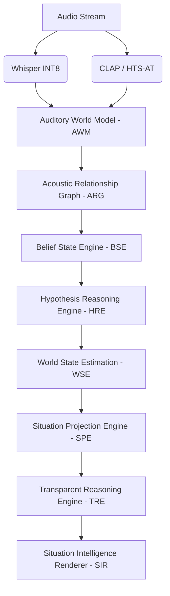

# 🎧 ALM v10.4: Cognitive Audio Scene Reasoning Engine (CASRE)

[](https://www.python.org/downloads/release/python-3110/)
[](https://opensource.org/licenses/MIT)

## Project Overview

ALM (Audio Language Model) v10 is an advanced, real-time deterministic cognitive reasoning architecture designed to parse complex, overlapping acoustic environments. Rather than relying on traditional neural network classification logic, ALM utilizes a symbolic-neuro hybrid architecture. It intercepts latent embeddings from state-of-the-art acoustic transducers (Whisper INT8, CLAP, HTS-AT), translates them into ecological nodes, and runs them through a six-stage cognitive pipeline to deduce hyper-specific real-world situations at $\mathcal{O}(1)$ latency.

## Motivation

Traditional audio classification systems suffer from modality collapse, temporal amnesia, and a lack of explainability. When a siren overlaps with spoken dialogue, simple classifiers either output "Music" (hallucination) or wildly oscillate. ALM was built to solve the "Cocktail Party Reasoning Problem." By separating perception (the neural networks) from cognition (the deterministic logic), ALM builds a persistent world state, hypothesizes competing scenarios, and clearly explains *why* it reached a conclusion, making it safe for critical deployment.

## Features

- **Six-Stage Cognitive Pipeline**: Deterministic logic flowing through AWM → ARG → BSE → HRE → WSE → SPE → TRE → SIR.
- **Hierarchical Confidence Modeling**: Propagates uncertainty throughout the entire logic chain to prevent confident hallucinations.
- **Zero-Latency State Tracking**: Active garbage collection and bounded acoustic graphs ($N < 20$) ensure strict $\mathcal{O}(1)$ real-time execution (<1ms).
- **Transparent Reasoning**: The Transparent Reasoning Engine (TRE) outputs an exact log of which beliefs supported which hypothesis, fully attributing causality.
- **Acoustic Transducer Agnostic**: ALM v10 intercepts outputs from Whisper Large-v3 Turbo (INT8) for linguistics and CLAP/HTS-AT for environmental cues.

## Architecture & Project Pipeline

ALM v10 strictly decouples perception from cognition. The pipeline relies on the following modules:



1. **AWM (Auditory World Model)**: Maintains the persistent state of all active audio sources.
2. **ARG (Acoustic Relationship Graph)**: Maps physical correlations (e.g., temporal overlap).
3. **BSE (Belief State Engine)**: Extracts atomic truths ("Siren is active").
4. **HRE (Hypothesis Reasoning Engine)**: Generates and competes hypotheses ("Emergency" vs "Movie Playing").
5. **WSE (World State Estimation)**: Locks in the dominant state based on momentum constraints.
6. **SPE (Situation Projection Engine)**: Predicts the immediate future trajectory.
7. **TRE (Transparent Reasoning Engine)**: Builds the causal trace for the final decision.
8. **SIR (Situation Intelligence Renderer)**: Formats the data into developer, human, or API JSON reports.

## Installation & Requirements

Ensure you are running Python 3.11+.

```bash
# Clone the repository
git clone https://github.com/yourusername/alm-project.git
cd alm-project

# Create virtual environment
python -m venv venv
source venv/bin/activate

# Install dependencies
pip install -r requirements.txt
```

### Docker Deployment
```bash
docker build -t alm-v10 .
docker run alm-v10
```

## Quick Start & Usage

To execute the ALM v10 pipeline with a mocked acoustic state (for validation):

```bash
python main.py
```
*Expected Output: Sub-1ms execution generating a complete SIR Developer Report for an overlapping speech/siren scenario.*

## Repository Layout (Structure)

```text
alm-project/
├── documentation/            # Project reports, history, and commands
├── reasoning_engine/         # Core Cognitive Pipeline
│   ├── awm/                  # Auditory World Model
│   ├── bse/                  # Belief State Engine
│   ├── hre/                  # Hypothesis Reasoning Engine
│   ├── wse/                  # World State Estimation
│   ├── spe/                  # Situation Projection Engine
│   ├── tre/                  # Transparent Reasoning Engine
│   ├── sir/                  # Situation Intelligence Renderer
│   ├── config.py             # Centralized System Configuration
├── tests/                    # Unit & Integration test suite
├── main.py                   # E2E Pipeline execution entry point
├── Dockerfile                # Deployment container
└── requirements.txt          # Python dependencies
```

## Model Downloads

ALM v10 relies on external pretrained acoustic transducers for perception. You must download the following weights if running the active perception layer:
- **Speech**: [Whisper Large-v3 Turbo INT8 via HuggingFace]
- **Environmental**: [CLAP Checkpoint] / [HTS-AT AudioSet Checkpoint]

## Supported Languages

The cognitive reasoning logic is primarily executed in English. However, because the perception layer utilizes Whisper, it is capable of tracking semantic events across 99+ languages natively before feeding the translated intent into the AWM.

## Known Limitations

- **Acoustic Transducer Initialization**: The raw `main.py` currently executes on a mocked AWM state. Real-world deployment requires binding a live microphone stream to the Whisper/CLAP inference server.
- **PyTorch Memory Fragmentation**: While ALM garbage collects perfectly, the underlying PyTorch threads for Whisper/CLAP may fragment GPU memory if run continuously for >24 hours without optimization.

## Future Work

- **Mini Project**: Create a WebSocket API wrapper around `main.py`.
- **Major Project**: Bind a live microphone buffer script to stream directly into the AWM.
- **Research Publication**: Publish the $\mathcal{O}(1)$ real-time constraint architecture at IEEE ICASSP.

## License

MIT License. See `LICENSE` for details.

## Citation

If you use ALM in your research, please cite:
```bibtex
@misc{alm_v10,
  author = {Your Name},
  title = {ALM v10: Deterministic Cognitive Reasoning for Overlapping Audio Scenes},
  year = {2026},
  publisher = {GitHub},
  journal = {GitHub repository},
  howpublished = {\url{https://github.com/yourusername/alm-project}}
}
```

## Acknowledgements

- **OpenAI** for the Whisper Architecture.
- **LAION** for CLAP contrastive pretraining.
- **AudioSet / HTS-AT** for baseline environmental classification.
