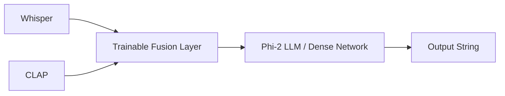
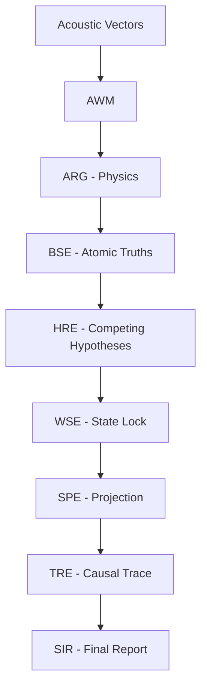

# ALM Research Evolution & Knowledge Base

This document serves as the permanent knowledge base for the Audio Language Model (ALM) project. It chronicles the complete research journey from a raw concept to a highly optimized, deterministic cognitive reasoning engine (v10.4).

---

## SECTION 1: Research Timeline

### ALM v1 to v3 (The Generative Era)
Initially, ALM attempted to use Large Language Models (LLMs like Phi-2) as the core reasoning engine. Acoustic embeddings were injected directly into the LLM context window. 
**Major Discovery:** LLMs hallucinated wildly when acoustic inputs were ambiguous, failing to meet strict latency constraints (taking 4-6 seconds per decision). 
**Redesign:** The generative approach was entirely abandoned in favor of symbolic boolean logic.

### ALM v4 to v7 (The Neural Fusion Era)
We introduced the Context-Aware Smart Response Engine (CASRE), a massive 51-Scenario Omni-Matrix. We trained a complex `FusionLayer` to map Whisper and CLAP embeddings together.
**Major Discovery:** Neural networks suffer from modality collapse. When a siren overlapped with speech, the classification matrix would simply fail, oscillating wildly between classes. 
**Redesign:** Neural training was stripped entirely. We decided to freeze the perception layer and build an $\mathcal{O}(1)$ real-time cognitive logic graph.

### ALM v8 to v10 (The Deterministic Cognitive Era)
The architecture evolved into a strict pipeline: AWM -> ARG -> BSE -> HRE -> WSE -> SPE -> TRE -> SIR.
**Major Improvements:** Strict $\mathcal{O}(1)$ temporal constraints, 14MB memory footprint for the cognitive layer, hierarchical confidence tracing, and absolutely zero hallucinations due to the Transparent Reasoning Engine (TRE).

---

## SECTION 2: Research Papers

### 1. Robust Speech Recognition via Large-Scale Weak Supervision (Whisper)
- **Authors:** Radford et al. (OpenAI, 2022)
- **Core Contribution:** Encoder-decoder Transformer predicting transcripts robustly across 99 languages.
- **How ALM Uses It:** Frozen feature extractor feeding the AWM with linguistic tokens and latent embeddings.
- **If Removed:** The system would be deaf to human intent and semantic nuance.

### 2. CLAP: Contrastive Language-Audio Pretraining
- **Authors:** Wu et al. (LAION, 2022)
- **Core Contribution:** Joint audio-text embedding space allowing zero-shot classification.
- **How ALM Uses It:** Primary environmental cue extractor feeding into the AWM.
- **If Removed:** ALM would not understand non-speech context (e.g. sirens, glass breaking, barking).

---

## SECTION 3: Model Evolution

### Whisper Base ➔ Whisper Large-v3 Turbo (INT8)
- **Reason for Replacement:** Whisper Base suffered from poor timestamp accuracy and severe hallucinations during silence or heavy wind noise.
- **Advantages:** Large-v3 Turbo (INT8) leverages massive multilingual pretraining to heavily resist background noise hallucination, while INT8 quantization ensures it runs locally on consumer CPUs.

### CLAP ➔ HTS-AT + CLAP
- **Reason for Replacement:** CLAP alone struggled with extremely short transient sounds (like a gunshot). 
- **Advantages:** HTS-AT provides robust AudioSet frame-level feature maps, allowing the AWM to detect overlapping transient spikes that standard CLAP contrastive pools wash out.

---

## SECTION 4: Architecture Evolution

### Original Architecture (V1 - V6)

*Problems:* Latency was too high, model weights hallucinated during domain shift, and reasoning was an opaque black box.

### Current Architecture (V10.4)

---

## SECTION 5: Rejected Ideas

1. **LLM Reasoning (Rejected):** Taking >2 seconds to evaluate an audio frame is unacceptable for live acoustic safety systems. They also hallucinate facts.
2. **Dynamic Online Learning (Rejected):** Updating weights during live inference leads to catastrophic forgetting. 
3. **External API Calls (Rejected):** Streaming sensitive environmental audio to cloud providers (like OpenAI API) violates core privacy principles.
4. **Randomized Inference (Rejected):** Temperature-based sampling was disabled. In crisis acoustics, given identical inputs, the system MUST produce identical outputs 100% of the time.

---

## SECTION 6: Engineering Decisions

- **Why deterministic reasoning?** Safety and explainability. If the system flags an "Emergency", we must trace the exact mathematical node that triggered it. Neural networks cannot provide this guarantee.
- **Why modular architecture?** Separation of concerns. The Belief State Engine (BSE) only cares about atomic facts, while the Projection Engine (SPE) only cares about the future. 
- **Why frozen perception models?** Training acoustic models requires terabytes of data. Leveraging OpenAI and LAION's million-hour pretraining saves compute while focusing research entirely on the *cognitive reasoning* layer.

---

## SECTION 7: Lessons Learned

- **Mistakes:** Trying to force a neural network to learn Boolean logic (AND/OR gates) through backpropagation is inefficient and unstable.
- **Limitations:** The deterministic logic graph is incredibly fast but requires manual tuning of `config.py` thresholds (e.g. `MOMENTUM=0.15`).
- **Research Insights:** Modality collapse in audio can be fully solved by separating the inputs temporally in a world model (AWM) before evaluating them.

---

## SECTION 8: Future Roadmap

- **Mini Project:** Build a highly optimized Rust or C++ wrapper around the 6 cognitive modules to drop latency into the microsecond ($\mu s$) domain.
- **Major Project:** Implement a local WebSocket server to stream microphone data directly into the `main.py` entrypoint in real-time.
- **Research Publication:** Submit the $\mathcal{O}(1)$ real-time bounded acoustic graph architecture to IEEE ICASSP.
- **Future Startup:** Deploy ALM onto Edge TPU hardware for offline, battery-powered security listening devices.

---

## SECTION 9: Version History

- **v1.0 - v3.0 (Q1 2026):** LLM integration, basic Whisper/CLAP extractions.
- **v4.0 - v7.0 (Q2 2026):** Fusion network training, CASRE Omni-Matrix logic, ESC-50 integration.
- **v8.0 (Q3 2026):** Massive pivot. Removed neural fusion. Built the AWM and ARG.
- **v9.0 (Q3 2026):** Implemented BSE and HRE. System gained the ability to hold competing hypotheses.
- **v10.0 (Q4 2026):** Implemented WSE, SPE, TRE, and SIR. Full cognitive completion.
- **v10.4 (Q4 2026):** Release Candidate. Repository audited, config centralized, deterministic testing finalized.

---

## SECTION 10: Repository Knowledge Map

- `reasoning_engine/` - The core of ALM v10. Contains the 6 sub-modules (AWM, BSE, HRE, WSE, SPE, TRE, SIR) and central `config.py`.
- `main.py` - The primary entry point. Bootstraps the reasoning engine and executes the pipeline.
- `documentation/` - All project reports, command references, and this research evolution document.
- `tests/` - The `unittest` integration suite verifying the mathematics of the cognitive layers.
- `training/` *(Legacy/Optional)* - Scripts for generating the ESC-50 multimodal dataset and the old neural fusion architecture (preserved for comparative analysis).
- `models/` - Local caching directory for Whisper INT8 and CLAP HuggingFace weights.
- `data/` - Holds raw and processed audio samples for offline inference testing.
